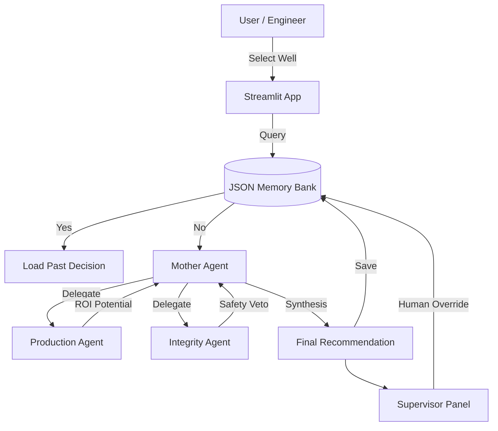

# 🛢️ PetroAgent: Multi-Agent Workover Orchestrator

**An Agentic AI system that automates workover candidate selection, resolves technical conflicts, and enables Human-in-the-Loop decision making.**


## 🚀 Business Problem
In mature oil assets, engineers spend nearly 40% of their time screening hundreds of wells to find valid workover candidates. A common bottleneck is the disconnect between **Production Engineering** (focused on revenue/rate) and **Well Integrity** (focused on safety/risk). 

This often leads to:
1.  **Wasted Analysis:** Candidates are proposed but later rejected due to mechanical constraints.
2.  **Mobilization Risk:** Crews are dispatched to wells that are structurally unsound.
3.  **Inconsistent Decisions:** Different engineers apply different criteria for selection.

## 💡 The Solution
**PetroAgent** is a Hub-and-Spoke Multi-Agent System (MAS) where specialized AI agents mimic a technical peer review:

1.  **Production Agent (The Revenue Driver):** Analyzes decline curves and offset potential to spot ROI opportunities.
2.  **Integrity Agent (The Safety Valve):** specialized agent with **Veto Power**. It scans wellbore diagrams for critical failures (e.g., collapsed casing) and blocks unsafe workovers regardless of potential oil gain.
3.  **Mother Agent (The Orchestrator):** Synthesizes the conflicting reports into a prioritized schedule.
4.  **Memory Bank:** A semantic caching layer that remembers past decisions, ensuring consistency and reducing API costs.

## 🏗️ System Architecture


## ✨ Key Features
### 1. Conflict Resolution Protocol
The system implements a strict hierarchy of authority. The Integrity Agent functions as a logic gate. If `blocking_flag=True` (e.g., casing collapse detected), the workflow terminates with a `NO GO` decision, preventing the Production Agent from maximizing unsafe barrels.

### 2. Semantic Caching (Long-Term Memory)
To mimic an engineer "remembering" a well, the system uses a persistent JSON store.

- Efficiency: If a well was analyzed yesterday, the system returns the cached result instantly (0 cost, 0 latency).

- Expiry Logic: Memories automatically expire after 7 days (configurable) to ensure data freshness.

### 3. Human-in-the-Loop (HITL)
AI is a tool, not the final decision-maker. The Supervisor Override Panel allows Senior Engineers to:

- Edit the proposed job type.

- Change the execution schedule.

- Add justification notes.

- Key Benefit: The AI updates its memory with the Human's correction, effectively "learning" from the engineer.

## 🛠️ Installation & Usage
**Prerequisites**
- Python 3.10+

- OpenAI API Key

**Steps**
1. Clone the repository

```Bash

git clone [https://github.com/yourusername/PetroAgent.git](https://github.com/yourusername/PetroAgent.git)
cd PetroAgent
```
2. Install dependencies
```Bash

pip install -r requirements.txt
```
3. Set up Environment Create a `.env` file in the root directory:
```Bash

OPENAI_API_KEY=sk-your-api-key-here
```
4. Run the Application

```Bash

streamlit run app/main.py
```
_____
## 📂 Project Structure
```Plaintext

PetroAgent/
│
├── 📂 app/
│   ├── main.py              # UI Entry point (Streamlit)
│   ├── agents.py            # LLM Logic (Prod, Integ, Mother)
│   ├── memory.py            # JSON-based persistence layer
│   └── models.py            # Pydantic data models (Structured Outputs)
│
├── 📂 data/
│   └── mock_db.json         # Simulated reservoir/well data
│
├── .env                     # API Keys (Not committed to repo)
├── requirements.txt         # Python dependencies
└── README.md                # Project documentation
```
## 🛡️ Data Governance & Safety
This project adheres to strict Data Management principles:

- Structured Data: All agent outputs are forced into strict schemas using Pydantic. This prevents "hallucinated" data formats that break downstream pipelines.

- Audit Trail: Every decision (AI or Human) is stamped with a source, timestamp, and technical_justification to ensure full traceability of the workover program.

## 🗺️ Roadmap
- [ ] Integration with SQL/OSI Pi for live production data.

- [ ] Retrieval Augmented Generation (RAG) to parse PDF daily drilling reports.

- [ ] Economic Agent to calculate NPV/IRR for each candidate.
____
Created by [Ade Anggi Naluriawan Santoso] - Petroleum Engineer & Data Scientist